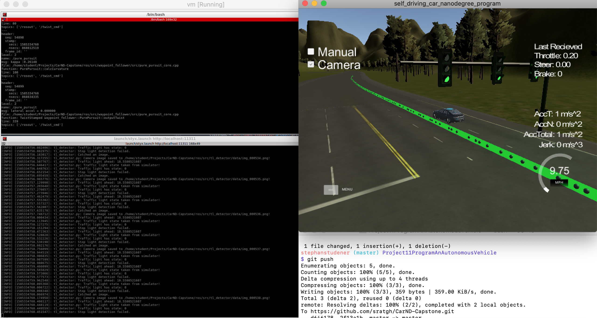
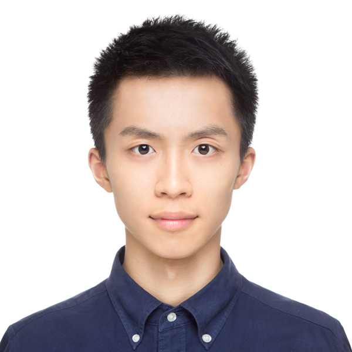
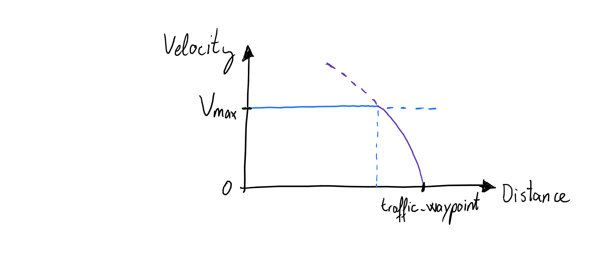

# Udacity's Self-Driving Car Engineer Nanodegree: System Integration, the Capstone-Project


This is a collaborative effort to attain the objectives of the capstone project of Udacity's Self Driving Car Engineer Program. The goal of this project is to develop different components of a self driving car software stack and integrate them into an appropriate operating system, the robot operating system (ROS), such that a real car that utilizes this system can navigate a test track in an autonomous manner. The software components implement many different parts of the software stack of an autonomous vehicle: They cover high-level vehicle control law for longitudinal and lateral dynamics, traffic light detection and classification and (simplified) path planing. Before launching the software in a real vehicle, the stack can be tested using Udacity's simulator.





Udacity's original repository with virgin files can be found [here](https://github.com/udacity/CarND-Capstone).

Udacity's original  repository wich provides the simulator can be found [here](https://github.com/udacity/CarND-Capstone/releases).

Udacity's original repository which provides the virtual machine can be found [here](https://s3-us-west-1.amazonaws.com/udacity-selfdrivingcar/Udacity_VM_Base_V1.0.0.zip).

## Team & Organization
Team consists of four individuals from Germany, Spain and the United States.


|     Image                   |     Name      |  LinkedIn or GitHub
|------------------------|---------------|-----------------------
|  | Stephan Studener | [Stephan](https://www.linkedin.com/in/stephanstudener/)
|  | Mario de la Rosa | [Mario](https://www.linkedin.com/in/mardetri/)
|  | Zihao Zhang | [Zihao](https://www.linkedin.com/in/zihao-zhang)
|  | Simon Rudolph | [Simon](https://www.linkedin.com/in/simon-rudolph-b4b762138/)


### Teamlead & Integration Engineer
Simon Rudolph takes the role of the team lead.
The teamlead takes responsibility to setup an integration & working environment. He owns the repository, manages branches and is the source of truth with respect to running the integrated software stack against project objectives in his environment (Udacity's Simulator running on a MacBook Pro and ROS running in a virtual machine on the same hardware as well as within the Udacity workspace).
### Developers for Control of Longitudinal and Lateral Vehicle Dynamics
Stephan Studener and Simon Rudolph act as developers for control of longitudinal and lateral vehicle dynamics.
The developers for vehicle controls take responsibility for control of the longitudinal and lateral dynamics dbw_node.py and twist_controller.py.
### Developers for Traffic Light Detection and Classification
Stephan Studener takes responsibility for implementing detection of traffic lights based on the available knowledge of the positions of the traffic lights and the car.
Simon Rudolph and Zihao Zhang work together to detect and classify the traffic light signals that the car approaches.
### Developers for Path Planning
Mario de la Rosa takes responsibility for implementing the path planner algorithm. This procedure can be found in the class WaypointUpdater defined in _waypoint_updater.py._
### Communication and Project Setup
The team follows the Kanban rules to reach it's objectives and meet twice a day for a "daily scrum".
This is necessary for everbody to stay in sync when working in very different time zones.
The team lead sets up the daily scrum as a Google Hangout using Google calendar.
The code base as well as the Kanban board is shared in the team lead's GitHub Repository.
To manage & communicate progress and throwbacks (bugs), the Kanban-Board is used as well.
Additionally Slack was setup for the team to have shared communication within different channels. This makes the synchronization outside the meetings a lot easier.

## Conventions
This section wraps up coding and committing convetions that have been applied.
### Coding Conventions: Typing, Language, Global Variables,..
The following conventions apply to the code base:
* The source code is written in English.
* Calibration parameters must be put into ros-nodes. These paramters may be changed before compile time to tune the behaviour of the code, e.g. the parameters of the PID-Controller. Example (see ros/src/twist_controller/dbw_node.py):
```python

TWIST_CONTROLLER_UPDATE_FREQUENCY = 10

class DBWNode(object):
    def __init__(self):
        rospy.init_node('dbw_node')
```
   * Calibration parameters must be global, written in capital letters and follow the "import"-section at the top of the Python-Document. This facilitates finding and tuning of the parameters. Example (see ros/src/twist_controller/dbw_node.py):
   ```python
   TWIST_CONTROLLER_UPDATE_FREQUENCY = 10
   ```

* Calibration parameters must have a comment above their definition explaining it's usage and impact on code behaviour. Example:
```python
# This parameter defines the frquency at which throttle, brake
# and steering command are send to the vehicle. It must be equal
# or larger than 10 Hz. Changing this parameter changes the
# closed loop behavior, i.e. if & how the vehicle follows the
# reference trajectory. If this paramter is changed, the
# controller parameters KP, KI, and KD may become invalid.
TWIST_CONTROLLER_UPDATE_FREQUENCY = 10
```
### Committing Culture: Language, Message Style, Features, Fixes,..
The following conventions apply to committing to the repository:
* Commits must have a description that explains why the changes have been made.
* Commits are i.e. features, fixes, documentation, refactoring... (See https://udacity.github.io/git-styleguide/)
* Commits which add new features must have a description that begin with _feat:_
* Commits which fix something (including missing documentation) must have a description that begin with _fix:_
* ...

##  Architecture of the stack as ROS-Graph
The following image shows the architecture of the software stack, that is completely based on the robot-operating system (ROS).

The nodes and their responsibilities are explained in the following.

### Control of Longitudinal and Lateral Vehicle Dynamics: The _twist_controller_-Package
In the twist controller package two files are subject to change compared to the original files which can be obtained from Udacity's repository (see above):
* dbw_node.py: This is the ROS-node which runs control of longitudinal and lateral vehicle dynamics and manages communication with other publishers and subscribers.
* twist_controller.py: This file keeps the class for the control algorithm.

Control of longitudinal vehicle dynamics is realized by a PID-control featuring anti-wind-up compensation. This means, that the controller is able to deal with the bounded actuator inputs, i.e. throttle and break command is bounded below by zero and above by individual thresholds. When the control law exceeds the bounds, the threshold is commanded and in the same time the value of the integrator state is clamped. The tuning parameters of the controller are initially taken from the "Controls"-Project of this Nanodegree and have been fine-tuned to attain the desired closed-loop-performance.
Control of the lateral vehicle dynamics is realized by a feedforward control law provided by Udacity, the _yaw_controller_.


The dbw_node.py has calibration parameters that may be tuned before compile time (before running _catkin_make_ [2]). These parameters are
* The update frequency of the commands for controlling the longitudinal and lateral vehicle dynamics:
```python
# This parameter defines the frquency at which throttle, brake
# and steering command are send to the vehicle. It must be equal
# or larger than 10 Hz. Changing this parameter changes the
# closed loop behavior, i.e. if & how the vehicle follows the
# reference trajectory. If this paramter is changed, the
# controller parameters KP, KI, and KD may become invalid.
TWIST_CONTROLLER_UPDATE_FREQUENCY = 10
```
* The gains of the PID-Controller [3] controlling the longitudinal vehicle dynamics by publishing brake and throttle:
```python
# PID-Controller tuning parameters, here: The proportional gain,
# the differential gain (KD) and the integral gain (KI).
KP = 0.18
KI = 0.0002
KD = 3.2
```
* The minimum break torque required to keep the vehicle in place:
```python
# As explained in the walk-through, break torque needed to keep the
# vehicle in place.
TORQUE_TO_KEEP_VEHICLE_STATIONARY = 700  # Nm
```


### Traffic Light Detection and Classification: The _tl_detector_ - Package
This package has two important parts: The detection of traffic lights and the classification of the signal of the traffic lights way ahead of a stop line.
The detection of traffic lights is based on knowledge of the position of traffic lights in the world and knowledge of the vehicle position in the world.
Roughly stated the node _tl_detection.py_ works as follows: If the vehicle approaches a traffic light and is sufficiently close, the classifier is invoked
and fed with the camera image, which is received frequently. The camera looks at the traffic light several times and once, it is assured that the light
is red, the controller of the longitudinal dynamics is told to bring the vehicle to a full stop. Otherwise the controller of the longitudinal dynamics is told to
keep the pace. The node tl_detection.py has calibration parameters that may be tuned before compile time (before running _catkin_make_ [2]).
These parameters are

* A threshold defining how often a traffic light has to be detected as red before the node publishes the traffic light ahead as being red.  This avoids toggeling to a certain degree when the classifier toggles.
```python
# This calibration paramter debounces the light state
# received from the camera, such that toggeling between
# different states is avoided in case the tl_classifier
# is not sure
STATE_COUNT_THRESHOLD = 3
```
* This calibration parameter activates a feature: Each image that is received by tl_detector is saved to disc when this parameter is True. Note: Inside ./ros/src/tl_detection there must be a folder called data. Otherwise this will not work. This consumes computational power and might be switched to False in the real vehicle.
```python
# This calibration paramter decides if images are saved
# to the linux-filesystem. This may sacrifice some computational
# power in favour of having the images for later analysis.
SAVE_CAMERA_IMAGES_IS_ACTIVE = True
```
* This calibration paramter allows to use the ground-truth value for traffic lights. This is available only in the simulator. Be sure to swith this to False when running the code in the real vehicle.
```python
# This calibration paramter decides if the traffic classifer
# light classifer is used or the state of the traffic light
# is taken from the simulator. Turn this to True only when
# using the code in the simulator!
USE_TRAFFIC_LIGHT_STATE_FROM_SIMULATOR = False
```
* This calibration parameter renders the rate for processing images and detecting traffic lights. It save a lot of computational ressources to turn this down. When it is too small, the vehicle will have moved a lot from where the camera captured an image and stopping in front of a red traffic light might not be possible because informations are not processed in time.
```python
# This calibration paramter renders the rate for
# processing images and detecting traffic lights
# It should be chosen by ansering the question how fast
# do images change and traffic lights disappear?
# Unit is Hz
TRAFFIC_LIGHT_DETECTION_UPDATE_FREQUENCY = 2
```
* This paramter is a threshold for triggering the classification of traffic light signals. When the vehicle is too far away from the traffic light (distance is larger than threshold), the camera image is received, but not processed. When the vehicle is close to a traffic light (distance is smaller than threshold), camera images are processed and traffic ligth signals are classified.
```python
# This calibration parameter allwos to tune the threshold in meters for paying
# attention to the state of traffic light. Below that threshold, camea images
# are processed, above this is not done.
SAFE_DISTANCE_TO_TRAFFIC_LIGHT = 80
```
A remark: This behaviour of this node is made deterministic by adding a _self.loop()_-member function that is called periodically. Although the images are published in a non-deterministic fashion, detection is running at a frequency defined by TRAFFIC_LIGHT_DETECTION_UPDATE_FREQUENCY.


### Path planning: The _waypoint_updater_ - Package
The path planning algorithm defines the final waypoints to be followed by the car. In order to compute this path, our class receives the base waypoints and it should select those to be commanded.

This node is subscribed to the following topics:
* _current_pose_
* _base_waypoints_: publishes a list of all waypoints for the track, so this list includes waypoints
                     both before and after the vehicle
* _traffic_waypoint_: it is the index of the waypoint for nearest upcoming red light's stop line

And it publishes final_waypoints, which are the list of waypoints to be followed.

There are two parameters that can be tuned:
* This calibration parameter defines the number of waypoints that will be published,
```python
LOOKAHEAD_WPS = 200
```
* This calibration parameter defines the maximum deceleration to be commanded.
```python
MAX_DECEL = .5
```

When a traffic waypoint index is received, commanded velocity is decreased gradually from maximum velocity to zero as depicted in the following figure.



## Installation
This is the project repo for the final project of the Udacity Self-Driving Car Nanodegree: Programming a Real Self-Driving Car. For more information about the project, see the project introduction [here](https://classroom.udacity.com/nanodegrees/nd013/parts/6047fe34-d93c-4f50-8336-b70ef10cb4b2/modules/e1a23b06-329a-4684-a717-ad476f0d8dff/lessons/462c933d-9f24-42d3-8bdc-a08a5fc866e4/concepts/5ab4b122-83e6-436d-850f-9f4d26627fd9).

Please use **one** of the two installation options, either native **or** docker installation.

### Native Installation

* Be sure that your workstation is running Ubuntu 16.04 Xenial Xerus or Ubuntu 14.04 Trusty Tahir. [Ubuntu downloads can be found here](https://www.ubuntu.com/download/desktop).
* If using a Virtual Machine to install Ubuntu, use the following configuration as minimum:
  * 2 CPU
  * 2 GB system memory
  * 25 GB of free hard drive space

  The Udacity provided virtual machine has ROS and Dataspeed DBW already installed, so you can skip the next two steps if you are using this.

* Follow these instructions to install ROS
  * [ROS Kinetic](http://wiki.ros.org/kinetic/Installation/Ubuntu) if you have Ubuntu 16.04.
  * [ROS Indigo](http://wiki.ros.org/indigo/Installation/Ubuntu) if you have Ubuntu 14.04.
* [Dataspeed DBW](https://bitbucket.org/DataspeedInc/dbw_mkz_ros)
  * Use this option to install the SDK on a workstation that already has ROS installed: [One Line SDK Install (binary)](https://bitbucket.org/DataspeedInc/dbw_mkz_ros/src/81e63fcc335d7b64139d7482017d6a97b405e250/ROS_SETUP.md?fileviewer=file-view-default)
* Download the [Udacity Simulator](https://github.com/udacity/CarND-Capstone/releases).

### How to get the simulator running on mac
Follow the link to the simulator and download the latest version for mac called `mac_sys_int.zip`.
Unzip with `unzip mac_sys_int.zip`. Now open up a terminal and `cd` into the app, which can be accessed like any normal folder.

Go to `mac_sys_int/sys_int.app/Contents/MacOS`. There you should see a file called `capstone_v2`. Give this file execution rights with
`chmod +x capstone_v2`.

Now you should be almost good to go. Except that mac is still warning about the fact that it does not now the developer of this app. To solve this problem you can, instead of just double clicking the app or opening it via terminal, right click on the app logo and click on open. Then it should give you the choice of opening the app nevertheless.

### Docker Installation
[Install Docker](https://docs.docker.com/engine/installation/)

Build the docker container
```bash
docker build . -t capstone
```

Run the docker file
```bash
docker run -p 4567:4567 -v $PWD:/capstone -v /tmp/log:/root/.ros/ --rm -it capstone
```

### Port Forwarding
To set up port forwarding, please refer to the "uWebSocketIO Starter Guide" found in the classroom (see Extended Kalman Filter Project lesson).

### Usage

1. Clone the project repository
```bash
git clone https://github.com/udacity/CarND-Capstone.git
```

2. Install python dependencies
```bash
cd CarND-Capstone
pip install -r requirements.txt
```
3. Make and run styx
```bash
cd ros
catkin_make clean (OPTIONAL)
catkin_make
source devel/setup.sh
roslaunch launch/styx.launch
```
4. Run the simulator

### Tipps & Tricks for problems with Docker
The docker installation itself was quite straightforward for me (installed on mac). After having opened the docker environment I tried installing the requirements via the above command
```bash
cd CarND-Capstone
pip install -r requirements.txt
```

This did not go through without errors. It complained about the python package mock. Therefore I first had to update pip itself inside the docker container with
```bash
pip install --upgrade pip
```

I then run
```bash
cd CarND-Capstone
pip install -r requirements.txt
pip install mock
```
After this detour it worked for me.


### Real world testing
1. Download [training bag](https://s3-us-west-1.amazonaws.com/udacity-selfdrivingcar/traffic_light_bag_file.zip) that was recorded on the Udacity self-driving car.
2. Unzip the file
```bash
unzip traffic_light_bag_file.zip
```
3. Play the bag file
```bash
rosbag play -l traffic_light_bag_file/traffic_light_training.bag
```
4. Launch your project in site mode
```bash
cd CarND-Capstone/ros
roslaunch launch/site.launch
```
5. Confirm that traffic light detection works on real life images

### Other library/driver information
Outside of `requirements.txt`, here is information on other driver/library versions used in the simulator and Carla:

Specific to these libraries, the simulator grader and Carla use the following:

|        | Simulator | Carla  |
| :-----------: |:-------------:| :-----:|
| Nvidia driver | 384.130 | 384.130 |
| CUDA | 8.0.61 | 8.0.61 |
| cuDNN | 6.0.21 | 6.0.21 |
| TensorRT | N/A | N/A |
| OpenCV | 3.2.0-dev | 2.4.8 |
| OpenMP | N/A | N/A |

We are working on a fix to line up the OpenCV versions between the two.

### Most important ROS commands
`rosnode list` Lists all ros nodes

`rosnode info <any node i.e. "/waypoint_loader" >` Lists specific information about that node

`rostopic list` Lists all ros topics

`rostopic info <any topic i.e. "/base_waypoints" >` Lists specific information about that topic

`rosmsg info <any message i.e. geometry_msgs/Twist>` Lists the specific message information

`rosed geometry_msgs Twist.msg` Lists even more information about the message Twist.msg

`rostopic echo <any topic i.e. "/base_waypoints">` Echos information about specific topic


## Literature cited
* Willow Garage, 2010, published [online](https://mirror.umd.edu/roswiki/attachments/de/ROScheatsheet.pdf): The ROS-Cheat-Sheet.
* Jason M. O'Kane, 2014, published by the University of South Carolina [online](https://www.cse.sc.edu/~jokane/agitr/agitr-letter.pdf): A Gentle Introduction to ROS
* Sigur Skogestad, 2005, published by Wiley: Multivariable Feedback Control
